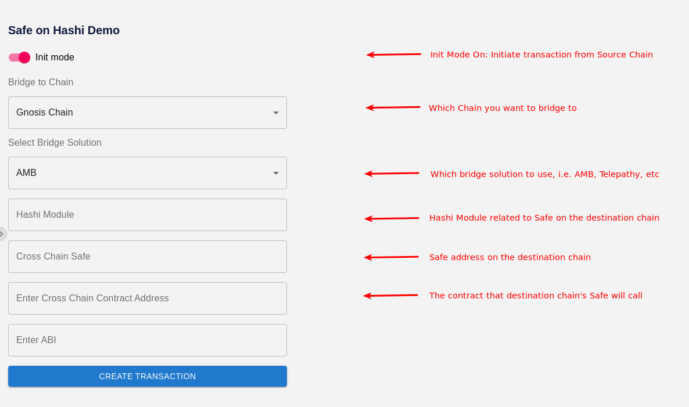
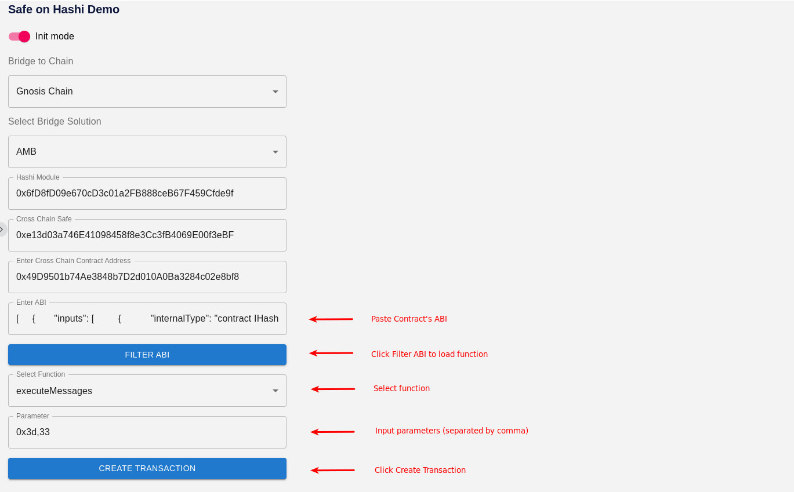
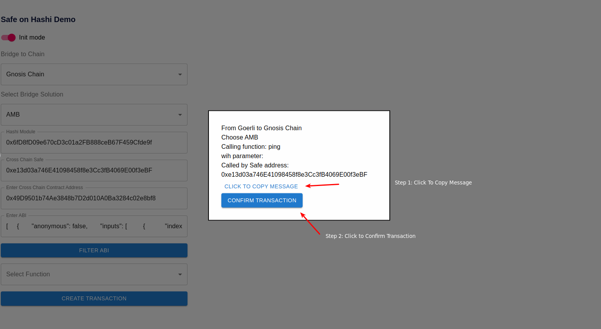
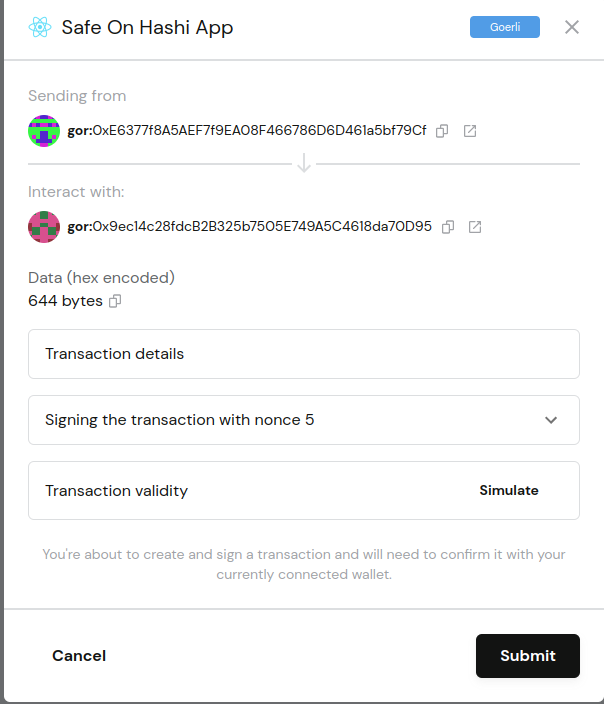
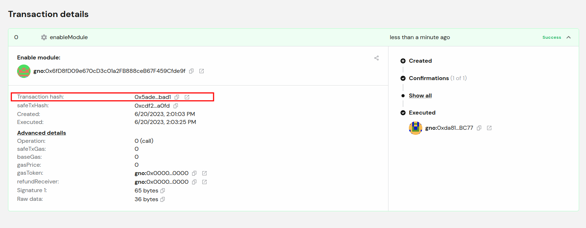
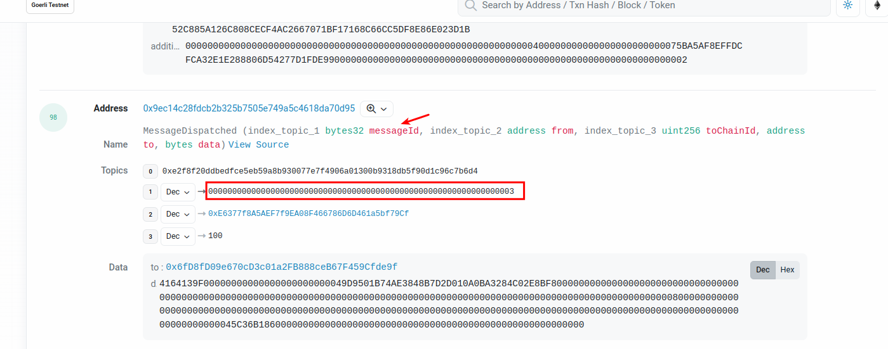
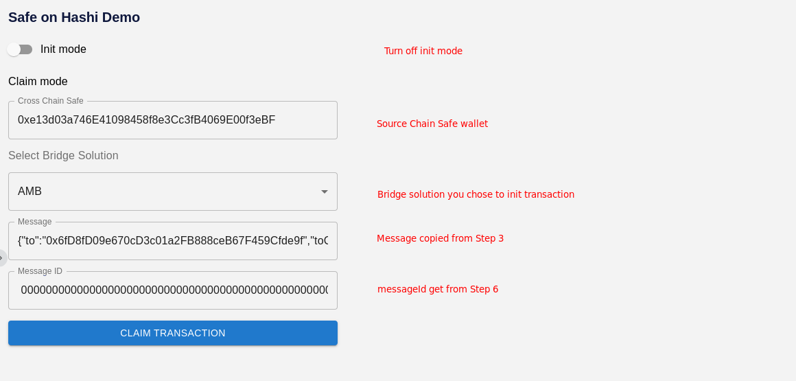
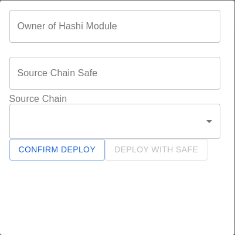

# How to use Safe on Hashi App

There are two steps you need to execute in order to control your destination chain Safe from source chain Safe: Init transaction on Source Chain and claim transaction on Destination Chain.

## Initiate transactation on Source Chain

Make sure to load the Safe on Hashi App and Add it to Custom app on Safe.
Refer to [README.md](../README.md) on guide to setup app.

### Step 1: Select Mode

**Connect your Safe to the source chain.**  
Turn on 'Init Mode' switch to initiate transaction.

Input the data accordingly:

1. Bridge to Chain: Select the chain you want to call.
2. Select Bridge Solution: Bridge solution that you want to use, i.e. AMB, Telepathy, Connext, etc.
3. Hashi Module: Hashi Module address that is related to destination (cross chain) Safe. Use [SafeOnHashi deploy:HashiModule task](https://github.com/zengzengzenghuy/SafeOnHashi) to deploy HashiModule
4. Cross Chain Safe: Destination Chain Safe you want to control.
5. Enter Cross Chain Contract Address: Destination Chain contract address that the Cross Chain Safe will call.

### Step 2: Select Function

1. Enter ABI: Enter ABI of cross chain contract
2. Click 'Filter ABI' to load function
3. Select function you want to call
4. (optional) Insert parameter of the function (separated by comma)
5. Click 'Create Transaction'

### Step 3: Confirm Transaction

Click To Copy Message: Click the button and save the message somewhere, it will be used for claiming transaction.

Check the transaction details and Click 'Confirm Transaction'

### Step 4: Submit Safe Transaction

After clicking 'Confirm Transaction', a Safe transaction detail dialog will pop up. Make sure the details are correct and Click 'Submit'

Once click 'submit', the transaction will be sent to Safe queue. Proceed the operation by connecting other owners and sign the transaction in order to reach the threshold.

### Step 5: Open block explorer

Once the transaction is executed on source chain, select the transaction hash. It will lead to source chain explorer, i.e. Etherscan.

### Step 6: Get messageId

On the transaction page, click 'Logs', and find the event called "MessageDispatched".

Save the **messageId** data for claiming the transaction on destination chain.

## Claim transaction on Destination Chain

After waiting for transaction bridging to destination chain\*\*, you may proceed to claim the message on destination chain.

** Different bridge solution requires different time to pass message, please check the bridge solution for more information.  
At the time this is written, **AMB** requires 20 blocks confirmation, **Telepathy\*\* requires Ethereum consensus finalization ~= 15mins.

### Step 7: Input claim transaction parameters

**Switch to destination chain and connect to destination chain Safe.**  
In order to create 'Claim Transaction', you need following data:

1. Cross Chain Safe: Safe address from source chain, it is the Safe address that you connected to create transaction on Init Mode. (Hex)
2. Bridge Solution: Bridge solution you chose to init transaction. (Select)
3. Message: Message data that you copied from step 3. (String)
4. MessageId: Message ID from Step 5 (Hex)

### Step 8: Claim Transaction

Once 'Claim Transaction' is clicked, you will create a normal Safe transaction. Sign it, once the threshold is reached, the claim transaction will be executed by Hashi Module.

# How to deploy Hashi Module

There are two ways to deploy a hashi module for Safe: CLI and Safe on Hashi App + Zodiac App.
Hashi Module should be deployed for the destination Safe/secondary Safe/counterfactual Safe.

### CLI

Using CLI provides more flexibility for deploying your Hashi Module as you can configure the constructor for your Hashi Module.
Refer to https://github.com/zengzengzenghuy/SafeOnHashi#deploy-hashi-module-for-safe
Once hashi module is deployed, Safe owners have to sign the `enableModule` transaction in the transaction queue and execute it once the threshold is reached.

### Safe on Hashi App + Zodiac App

Using the app provides more user friendly approach to deploy and enable hashi module.

### Deploy Hashi Module

In Prerequisite, Select **Click to Deploy** in Step 2: Deploy Hashi Module for Safe on Destination Chain  
.  
`owner`: Owner of the Hashi Module, usually is the owner address in destination Safe.  
`Source Chain Safe`: Safe address on source chain.  
`Source Chain`: Source chain where main Safe resides, please choose Goerli if you want to test the app.  
Click **Confirm deploy**, and confirm the transaction on your wallet. Once the transaction is executed, get your address on newly created contract on block explorer. It will show up in the `To:` section in the transaction details, i.e. https://gnosisscan.io/tx/0xb8fdfb761fd1be5d74ae2266111b2ad455b9143e34ed97ca34a2c79c75bbb55f.

### Enable Hashi Module

Navigate to Zodiac App: Apps-> Search "Zodiac" -> Select "Custom Module"  
In **Module address**, enter your newly created Hashi Module address from the step above.  
Click **Add MOdule** and execute the Safe transaction.

Reference: https://zodiac.wiki/index.php/Category:Custom_Module

# How to use History section

TODO

# How to prove and verify an address

TODO

# How to run off-chain verifier

Check out [server/README.md](../server/README.MD)
