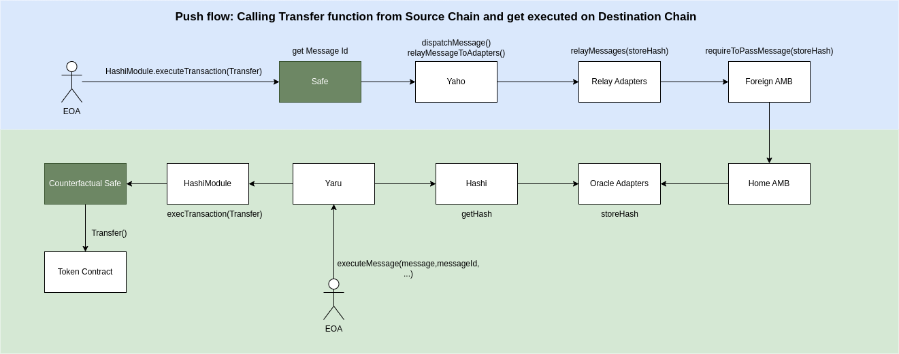

# Understanding the workflow

The diagram shows the entire workflow of creating and claiming a transaction using this app.

### Creating a transaction

1. Safe(or EOA) calls Yaho contract `dispatchMessagesToAdapters()` with calldata includes which chain, function, parameter to call to.
2. Yaho dispatch messages and relay the message to relayer contract. MessageDispatched() event is emitted from this transaction, which contains `messageId` that is necessary for claiming the transaction.
3. Relayer relay messages to bridges (i.e. AMB)
4. Message is passed by bridge.
5. Bridge calls `storeHash()` in adapter contract. The hash of the transaction is stored in adapter contract eventually. (Note: This hash is not the same hash as the block header that can be obtained from ShoyuBashi contract)

### Claiming a transaction

1. Safe(or EOA) calls `executeMessage()` from Yaru contract with message, messageId, bridge as parameters.
2. Yaru checks the validity of message hash by calling Hashi `getHash()`, and return by Adapter contract. Yaru compare the equivalence of hash from Hashi and from Safe(or EOA).
3. If two hash is equivalent, Yaru call HashiModule `execTransaction()`.
4. HashiModule execute transaction on behalf of Safe.
