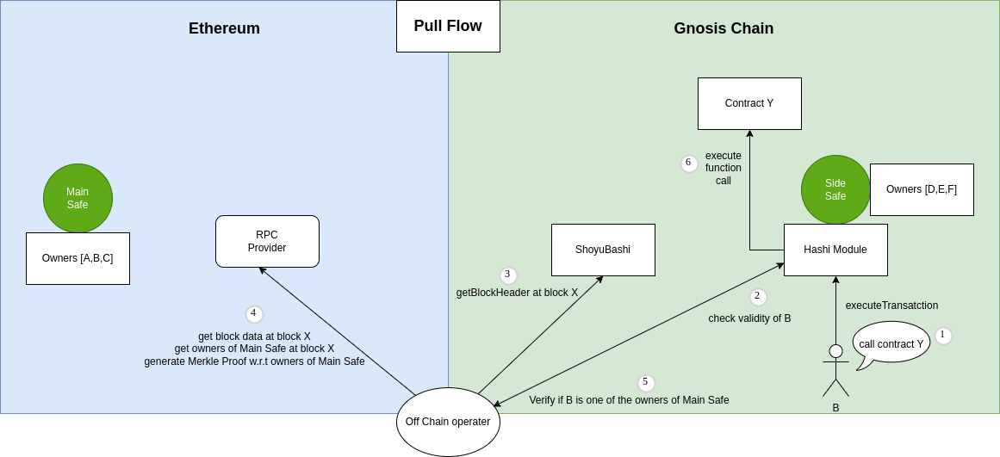

# Understanding the workflow

## Solution

Using pull flow to read data from Ethereum from time to time, generate merkle proof and verify the data, with block header from ShoyuBashi as trusted source.
If the proof is valid, the address can call Hashi Module of secondary Safe to create transaction.

## Prerequisite

1. Safe on both side of the chain
2. Hashi Module deployed w.r.t Safe to call

## Prove and Verify owner

0. Switch the metamask network to Ethereum, address to the user address that you want to prove.
1. call `eth_getProof` from Ethereum node.
2. call `getThresholdHash()` from ShoyuBashi on Gnosis Chain.
3. pass the data to offchain verifier (refer to /server to understand how to run an offchain verifier).
4. Offchan verifier return the verification result(boolean) back to user.

## Create transaction

0. Switch the metamask network to Gnosis Chain.
1. Input Hashi Module address.
2. Input Contract address.
3. Input Contract ABI and click Filter ABI.
4. Select contract function and insert parameter(if needed).
5. Click Create Transaction.
6. Sign and execute transaction using Metamask.
