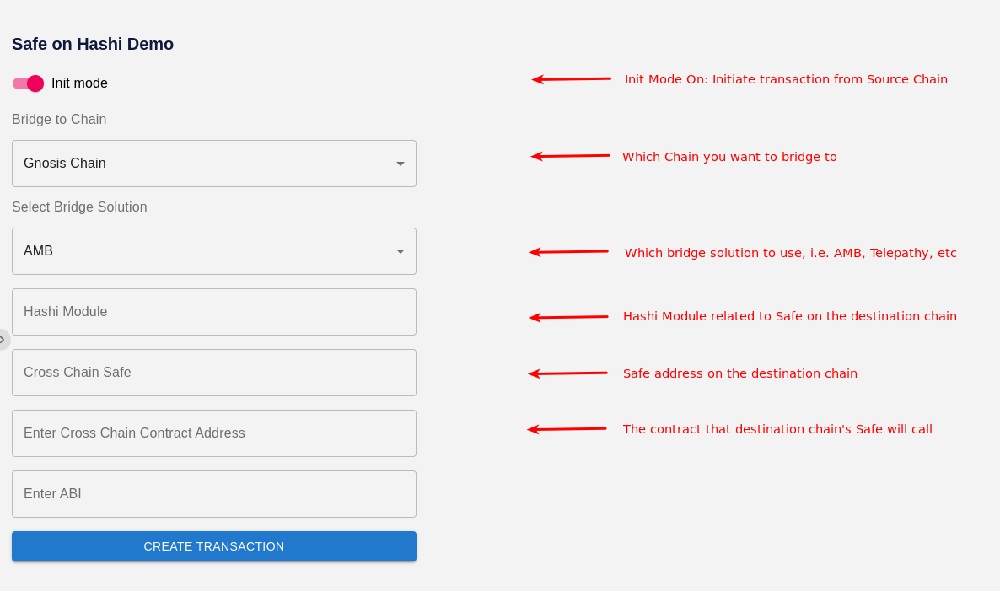
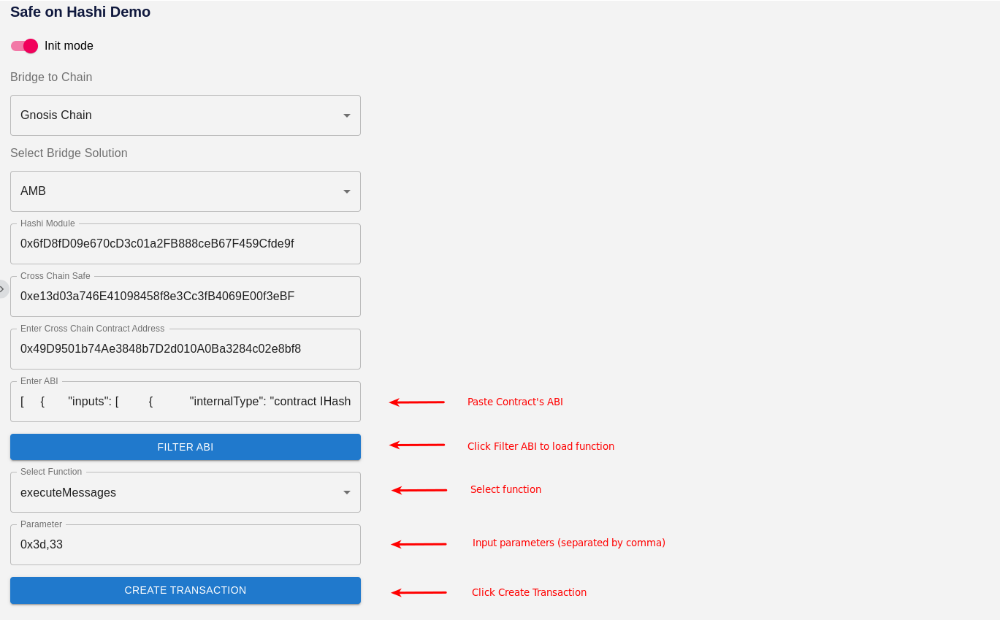
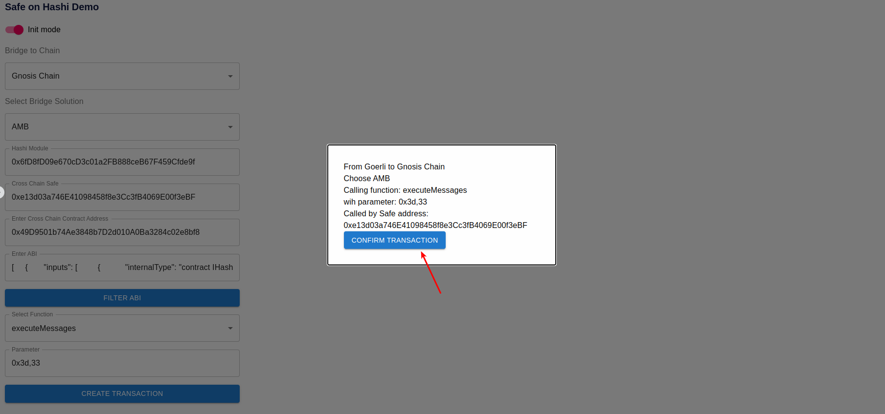
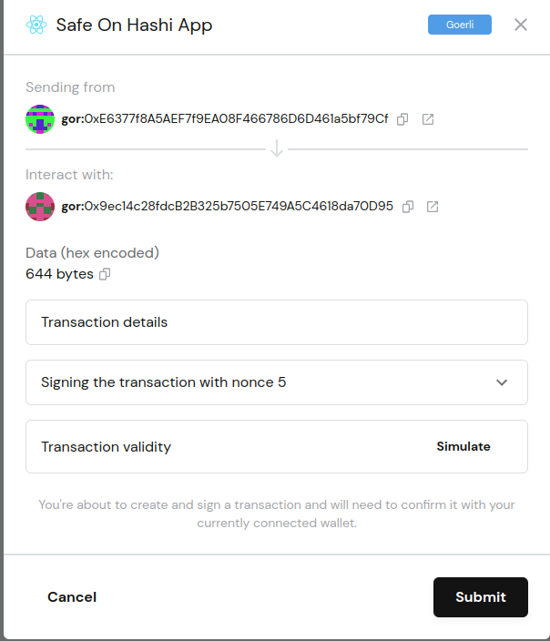
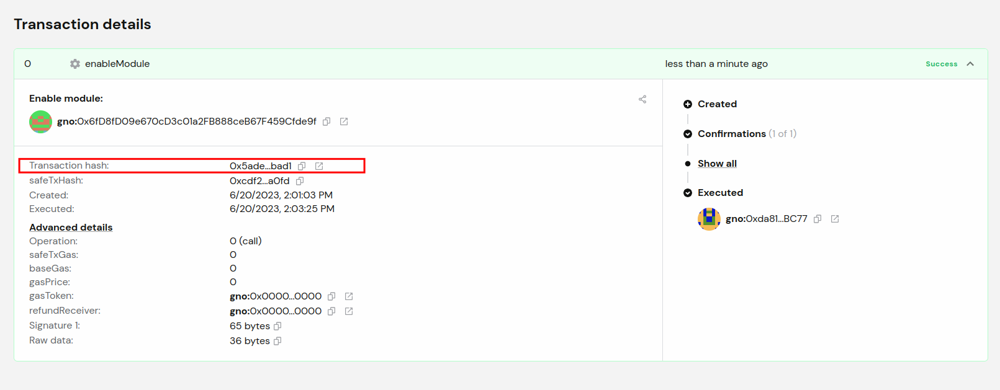
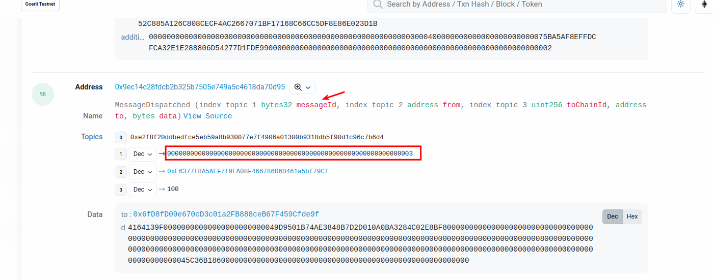

# How to use Safe on Hashi App

There are two steps you need to execute in order to control your destination chain Safe from source chain Safe: Init transaction on Source Chain and claim transaction on Destination Chain.

## Initiate transactation on Source Chain

Make sure to load the Safe on Hashi App and Add it to Custom app on Safe.
Refer to [README.md](../README.md) on guide to setup app.

### Step 1: Select Mode

Connect your Safe to the source chain.  
Turn on 'Init Mode' switch to initiate transaction.

Input the data accordingly:

1. Bridge to Chain: Select the chain you want to call.
2. Select Bridge Solution: Bridge solution that you want to use, i.e. AMB, Telepathy, Connext, etc.
3. Hashi Module: Hashi Module address that is related to destination (cross chain) Safe. Use [SafeOnHashi deploy:HashiModule task](https://github.com/zengzengzenghuy/SafeOnHashi) to deploy HashiModule
4. Cross Chain Safe: Destination Chain Safe you want to control.
5. Enter Cross Chain Contract Address: Destination Chain contract address that the Cross Chain Safe will call.

### Step 2: Select Function

1. Enter ABI: Enter ABI of cross chain contract
2. Click 'Filter ABI' to load function
3. Select function you want to call
4. (optional) Insert parameter of the function (separated by comma)
5. Click 'Create Transaction'

### Step 3: Confirm Transaction

Check the transaction details and Click 'Confirm Transaction'

### Step 4: Submit Safe Transaction

After clicking 'Confirm Transaction', a Safe transaction detail dialog will pop up. Make sure the details are correct and Click 'Submit'

Once click 'submit', the transaction will be sent to Safe queue. Proceed the operation by connecting other owners and sign the transaction in order to reach the threshold.

### Step 5: Get messageId

Once the transaction is executed on source chain, select the transaction hash. It will lead to source chain explorer, i.e. Etherscan.

On the transaction page, click 'Logs', and find the event called "MessageDispatched".

Save the **messageId** data for claiming the transaction on destination chain.

## Claim transaction on Destination Chain

TODO
